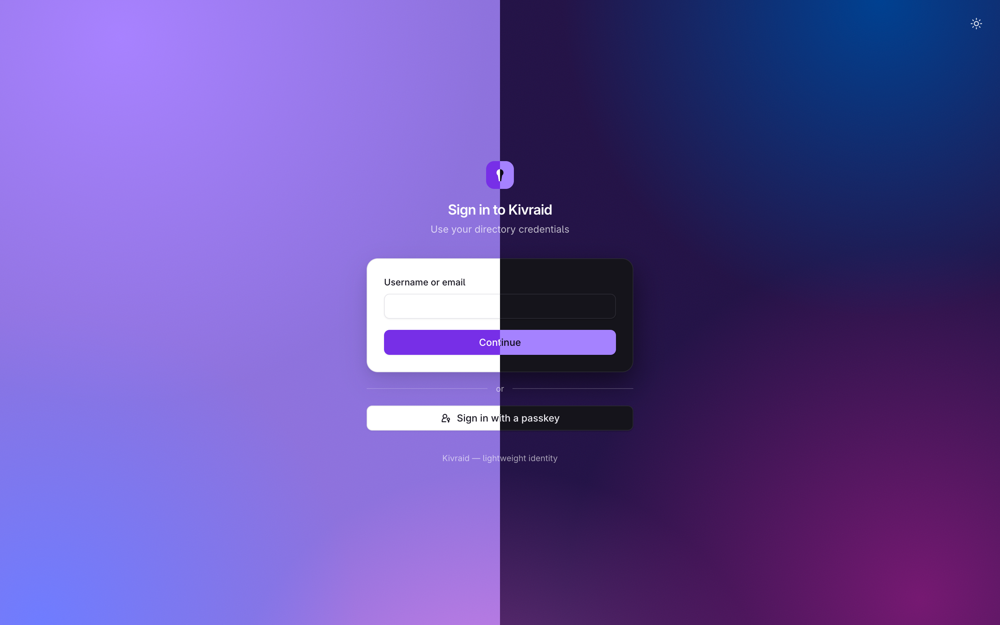
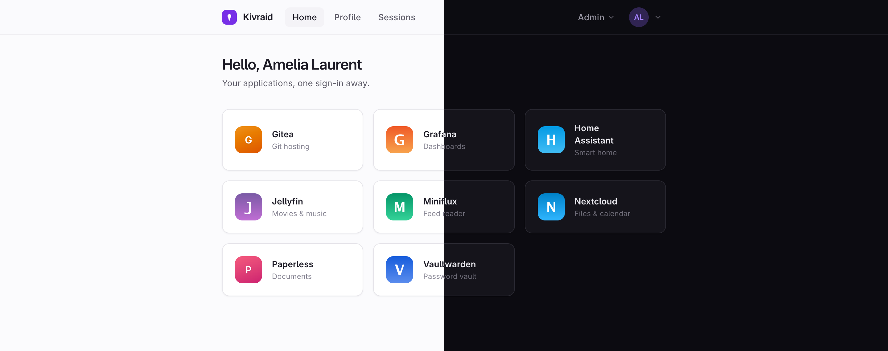
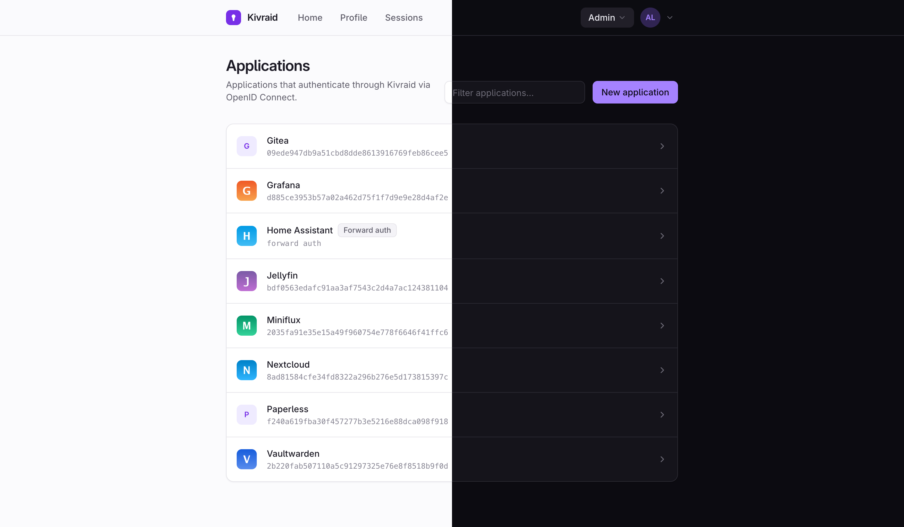

<p align="center">
  
</p>

<h1 align="center">Kivraid</h1>

<p align="center">
  A modern, lightweight identity provider — SSO for your apps,<br>
  shipped as <strong>one static Go binary</strong> with an embedded database.
</p>

<p align="center">
  <a href="#quickstart">Quickstart</a> ·
  <a href="#features">Features</a> ·
  <a href="#how-it-compares">Compare</a> ·
  <a href="docs/configuration.md">Docs</a>
</p>

<p align="center">
  <a href="https://github.com/kivraid/kivraid/actions/workflows/ci.yml"></a>
  <a href="https://github.com/kivraid/kivraid/releases/latest"></a>
  <a href="LICENSE"></a>
</p>

---

Kivraid does the same core job as [Authentik](https://goauthentik.io/):
single sign-on in front of your applications, with users from a local
database or an LDAP directory. The difference is what it takes to run it.

Authentik is a Python platform that needs PostgreSQL, Redis and background
workers. Kivraid is **a single binary with an embedded SQLite database** —
no external services, no runtime, no worker fleet. It idles at around
**26 MB of RAM** and adapts to whatever memory limit you give the
container. And it comes with a genuinely nice, fast web UI in light and
dark — no SPA.

If you want most of Authentik's day-to-day value on a small host — a Pi, a
cheap VPS, a homelab, a side of an existing app — without the operational
weight, that's what Kivraid is for.

## Why Kivraid

- 📦 **One binary, zero dependencies** — static Go binary, embedded SQLite.
  No Python, PostgreSQL, Redis or workers to run. (PostgreSQL is optional
  for larger installs.)
- 🪶 **Tiny footprint** — ~26 MB idle RSS; `GOMEMLIMIT` is set from the
  container's limit so the GC respects your budget and survives login
  bursts without OOM.
- ✨ **A UI you'll actually enjoy** — server-rendered, fast, light & dark,
  built with Tailwind. Login, self-service portal and admin all polished.
- 🔋 **Batteries included** — OIDC provider, forward auth, LDAP, TOTP and
  passkeys, an admin console and an audit trail, all in the box.
- 🔒 **Secure by default** — revocable server-side sessions, CSRF, strict
  CSP, rate limiting, and every secret hashed or encrypted at rest.

**No hand-rolled crypto or protocols.** The security-critical parts are
established, maintained libraries: the OIDC server is
[zitadel/oidc](https://github.com/zitadel/oidc), passkeys use
[go-webauthn](https://github.com/go-webauthn/webauthn), password hashing
is Argon2id from `golang.org/x/crypto`, LDAP speaks
[go-ldap](https://github.com/go-ldap/ldap), and every SQL query is
compile-time-checked by [sqlc](https://sqlc.dev). The full list of
choices — and the reasoning behind each — is in
[DESIGN.md](DESIGN.md#key-library-choices).

## Screenshots

<sub>Each capture is split down the middle: light theme on the left,
dark on the right.</sub>

<p align="center">
  <br>
  <em>Sign in — clean, themeable, with passwordless passkey support.</em>
</p>

<p align="center">
  <br>
  <em>The self-service portal: app launcher, profile, sessions, 2FA and passkeys.</em>
</p>

<p align="center">
  <br>
  <em>Admin: applications, directories, users, groups and the audit log.</em>
</p>

## Features

- **OpenID Connect provider** — authorization code flow with PKCE, refresh
  token rotation, discovery, JWKS (ES256, keys encrypted at rest),
  userinfo, introspection, revocation, RP-initiated logout.
- **Forward auth** — protect apps without native SSO via Traefik, nginx or
  Caddy, registered as first-class applications with their own group access
  policy. See [docs/forward-auth.md](docs/forward-auth.md).
- **User sources** — local accounts (Argon2id) and live LDAP directories
  (OpenLDAP, LLDAP): bind authentication, paged group sync (RFC 2696),
  self-service password change written back via RFC 3062, and optional
  admin/email password reset through the service account. See
  [docs/ldap.md](docs/ldap.md).
- **Upstream federation (broker)** — sign users in through an upstream
  OpenID Connect provider (Authentik, Keycloak, Google, …); Kivraid acts as
  the relying party. Home-realm discovery routes each entered identifier to
  the right provider by exact match or email domain (falling back to a
  default). Accounts are provisioned on first login, linked to an existing
  account only on a mutually-verified email, and their groups mirrored.
- **Two-factor authentication** — optional TOTP (authenticator apps) with
  single-use recovery codes, for local and directory users alike; admins
  can reset a locked-out user.
- **Passkeys (WebAuthn)** — register device biometrics or a security key
  and sign in passwordless; a discoverable passkey is phishing-resistant
  and stands in for both password and second factor.
- **Account chooser** — a browser that already signed in offers its
  remembered accounts, with name and avatar, on the sign-in page. The list
  lives in an encrypted cookie, so a stranger typing an identifier still
  learns nothing about whether the account exists.
- **Email** — optional SMTP delivery, configured in the admin (password
  encrypted at rest) with a test-send button. Powers self-service password
  reset ("forgot password") and email-address verification; the OIDC
  `email_verified` claim reflects the real state.
- **User portal** — application launcher, profile, password change, email
  verification, two-factor and passkey enrollment, session list with
  revocation.
- **Admin** — an overview dashboard; an application wizard (OIDC or
  forward-auth) with the client secret displayed and rotatable,
  ready-to-paste setup snippets (Grafana, Gitea, Nextcloud, generic),
  editable token lifetimes and uploadable icons; group-based access policies;
  user invitations by email, generated passwords and a forced password
  change at first sign-in;
  directory management with a connection test; user impersonation for
  support; an append-only audit trail you can filter and export to CSV; and
  a grouped Settings area — branding (name, logo, sign-in background),
  email/SMTP, security (two-factor policy, sign-in alerts, automatic
  signing-key rotation) and read-only system diagnostics.
- **Hardening** — server-side revocable sessions, CSRF, strict CSP, login
  rate limiting, all secrets hashed or encrypted at rest.
- **SQLite or PostgreSQL** — SQLite by default (zero external services);
  Postgres for larger installs. The full test suite runs against both.

## Quickstart

**Docker** — multi-arch (amd64/arm64) image on GHCR, built `FROM scratch`,
runs unprivileged, all state in `/data`:

```sh
docker volume create kivraid
docker run -d --name kivraid -v kivraid:/data -p 9000:9000 \
  ghcr.io/kivraid/kivraid
```

Or with Compose: copy [docker-compose.yml](docker-compose.yml) and
`docker compose up -d` — there is also a
[PostgreSQL-backed variant](docker-compose.postgres.yml).

**Binary** — prebuilt for Linux and macOS (amd64/arm64) on the
[releases page](https://github.com/kivraid/kivraid/releases):

```sh
tar xzf kivraid_*_$(uname -s | tr A-Z a-z)_$(uname -m | sed 's/x86_64/amd64/').tar.gz
./kivraid serve            # http://127.0.0.1:9000
```

**From source** — requires Go 1.26+ (the Tailwind CSS standalone CLI is
downloaded automatically by `make`; no Node required):

```sh
make build
./kivraid serve
```

Either way, Kivraid generates its config with a random `secret_key` on
first run — no init step. Open the instance and register the administrator
account on first visit. See [docs/deployment.md](docs/deployment.md) for
systemd and the resource footprint.

Releases are cut by pushing a `YYYY.MM.DD.HHMMSS` tag (or the workflow's
"Run workflow" button, which computes and pushes one for you); the `latest`
image tag always tracks the newest one.

## How it compares

The self-hosted auth landscape runs from minimal OIDC providers to full
identity platforms. Kivraid sits in the middle: more than a passkey-only
OIDC provider, far lighter than a platform. The table is a spectrum from
narrow to broad.

| | Pocket ID | TinyAuth | **Kivraid** | Authelia | Authentik |
|---|---|---|---|---|---|
| Runtime | one Go binary | one Go binary | one Go binary | one Go binary | Python + workers |
| Required services | none (SQLite) | none | none (SQLite; Postgres optional) | none (SQLite; Redis for HA) | PostgreSQL + Redis |
| Idle memory | tens of MB | tens of MB | ~26 MB | tens of MB | hundreds of MB |
| Managed via | web admin | env vars | web admin | config files | web admin |
| User sources | local (passkey) | local + LDAP + social | local + LDAP + OIDC upstream | file / LDAP | local / LDAP / social |
| Auth methods | passkeys | password, TOTP, OAuth | password, TOTP, passkeys | password, TOTP, WebAuthn, Duo | many |
| Forward auth | ✗ | ✓ (its origin) | ✓ | ✓ (its core job) | ✓ (proxy outpost) |
| Protocols | OIDC | OIDC, forward auth | OIDC, forward auth | OIDC, forward auth | OIDC, SAML, LDAP/RADIUS, proxy |
| SAML | ✗ | ✗ | ✗ | ✗ | ✓ |

**Reading it:** [Pocket ID](https://github.com/pocket-id/pocket-id) is the
closest in spirit — same single-binary-plus-SQLite DNA — but deliberately
passkey-only and OIDC-only; pick it if that's genuinely all you need.
[TinyAuth](https://tinyauth.app/) is close in footprint — also a single Go
binary, now an OIDC provider with forward auth and upstream/social login —
but declarative like Authelia: configured entirely by environment
variables, with no database or admin UI.
[Authelia](https://www.authelia.com/) overlaps heavily (Go, lightweight,
forward auth, OIDC) but is declarative: users and rules live in config
files, with powerful per-resource access control and no admin UI — great
for a GitOps setup. [Authentik](https://goauthentik.io/) and
[Keycloak](https://www.keycloak.org/) are full platforms (SAML, flow
engines, federation, multi-tenancy) at the cost of a much heavier runtime.
[Kanidm](https://kanidm.com/) is another lightweight, passkey-first option
(Rust) if you want its own directory and replication.

**What Kivraid does _not_ do** (by design): no visual flow engine, no SAML,
no RADIUS or LDAP-server outposts, no SCIM provisioning, no multi-tenancy.
If you need those, reach for Authentik or Keycloak.

<sub>Comparisons reflect these projects as of 2026 and are simplified;
they move fast, so verify current capabilities before relying on them.</sub>

## Documentation

- [Configuration](docs/configuration.md) — config file, env overrides, TLS,
  connecting an application.
- [Integrations](docs/integrations/) — step-by-step OIDC recipes for
  Grafana, Nextcloud, Gitea, Proxmox, and a generic reference.
- [LDAP directories](docs/ldap.md) — bind auth, group models, write-back.
- [Forward auth](docs/forward-auth.md) — protecting apps without native SSO.
- [Federation](docs/federation.md) — sign users in through an upstream OIDC
  provider, with home-realm-discovery routing.
- [Deployment](docs/deployment.md) — Docker, systemd, resource footprint.
- [DESIGN.md](DESIGN.md) — architecture decisions and roadmap.

## Development

```sh
make build          # generate CSS + sqlc code, then go build
make run            # build, then serve with ./kivraid.yaml
make dev            # same, rebuilding and restarting on every source change
make css-watch      # rebuild CSS on template changes
make test           # run tests (add KIVRAID_TEST_POSTGRES_DSN for Postgres)
make screenshots    # regenerate the README captures (needs Chrome)
```

## License

Apache 2.0 — see [LICENSE](LICENSE).
